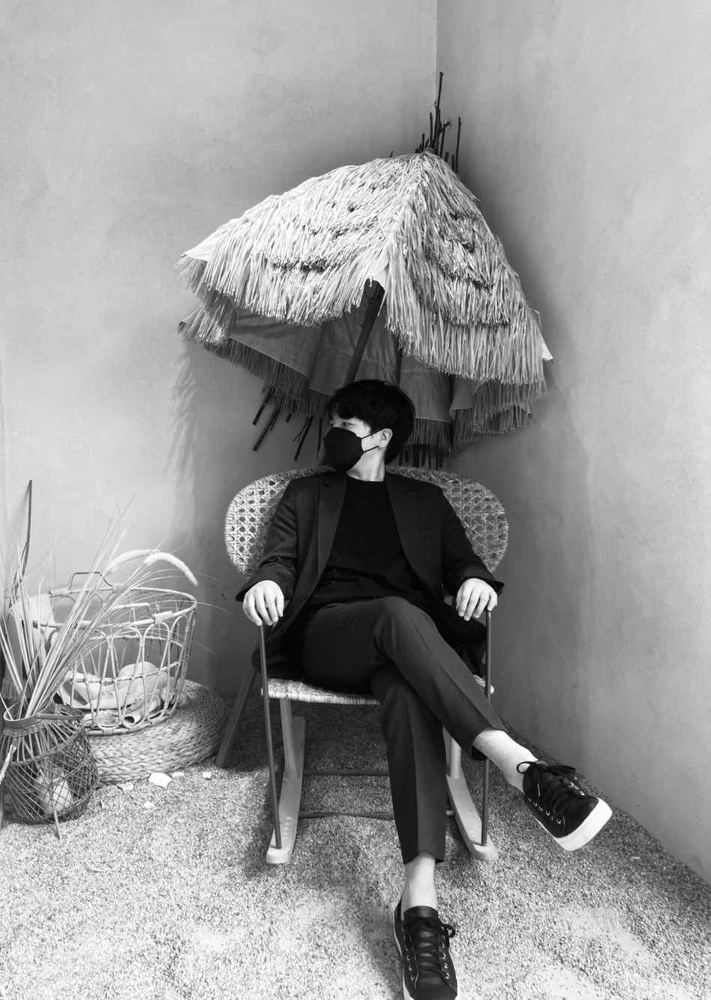

### [Junho Kim](http://bit.ly/jhkim_resume)
#### 👉 Research Scientist at [NAVER AI Lab](https://naver-career.gitbook.io/en/teams/clova-cic)

## Recent implementations
* 🔥 *[Diffusion-Tensorflow](https://github.com/taki0112/Diffusion-Tensorflow)*
* *[CLIP-Tensorflow](https://github.com/taki0112/CLIP-Tensorflow)*
* *[Vision Transformer Cookbook](https://github.com/taki0112/vit-tensorflow)*

## Recent accepted papers
* 🔥 *[Feature Statistics Mixing Regularization for Generative Adversarial Networks](https://github.com/naver-ai/FSMR)* **`CVPR 2022`**
* *[Generating Videos with Dynamics-aware Implicit Generative Adversarial Networks](https://sihyun-yu.github.io/digan/)* **`ICLR 2022`**

## Publications
* *Rarity Metric : A New Metric to Evaluate the Uncommonness of Synthesized Images* **`Under review`**
* *Generator-Guided Regularization for Discriminator in Unconditional Image Generation* **`Under review`**
* *Learning Input-agnostic Manipulation Directions in StyleGAN with Text Guidance* **`Under review`**
* ⚡ *[Feature Statistics Mixing Regularization for Generative Adversarial Networks](https://arxiv.org/abs/2112.04120)* **`CVPR 2022`**
* *[Generating Videos with Dynamics-aware Implicit Generative Adversarial Networks](https://sihyun-yu.github.io/digan/)* **`ICLR 2022`**
* *[Exploiting Spatial Dimensions of Latent in GAN for Real-time Image Editing](https://github.com/naver-ai/StyleMapGAN)* **`CVPR 2021`**
* ⭐ *[U-GAT-IT: Unsupervised Generative Attentional Networks with Adaptive Layer-Instance Normalization for Image-to-Image Translation](https://github.com/taki0112/UGATIT)* **`ICLR 2020`**

<!--

### Hi there 👋
**taki0112/taki0112** is a ✨ _special_ ✨ repository because its `README.md` (this file) appears on your GitHub profile.

Here are some ideas to get you started:

- 🔭 I’m currently working on ...
- 🌱 I’m currently learning ...
- 👯 I’m looking to collaborate on ...
- 🤔 I’m looking for help with ...
- 💬 Ask me about ...
- 📫 How to reach me: ...
- 😄 Pronouns: ...
- ⚡ Fun fact: ...
-->
